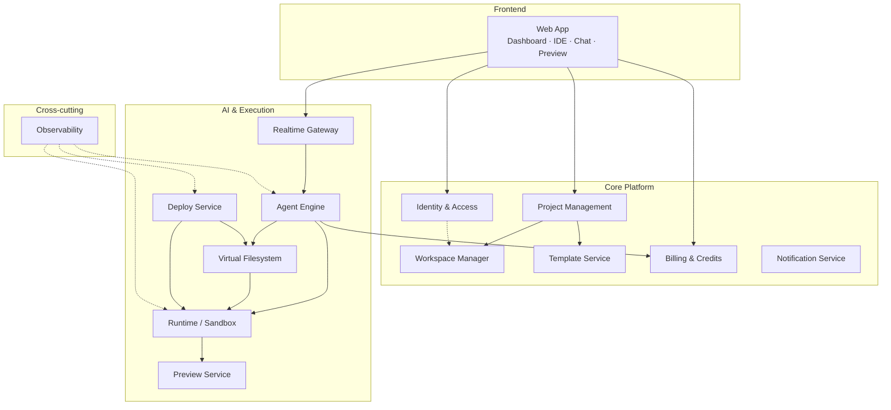
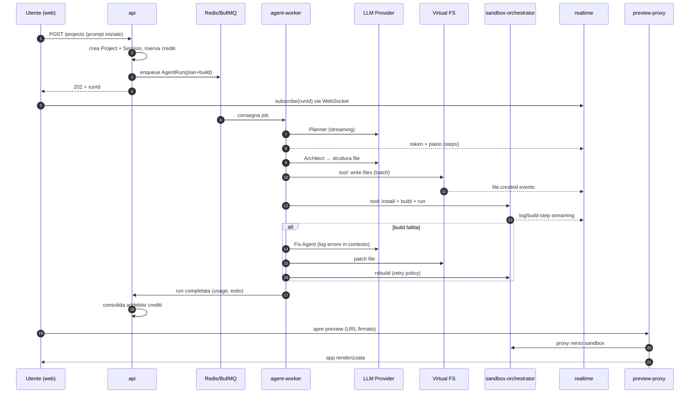
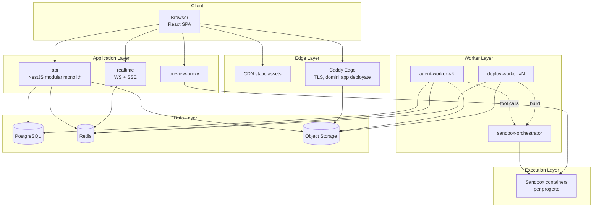
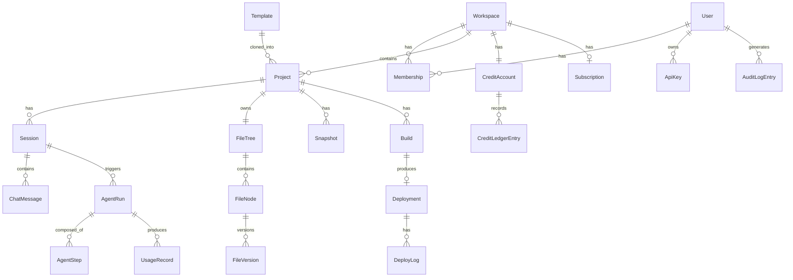

# FASE 0 — Analisi Completa della Piattaforma

**Prodotto:** EmErGent v2 — AI App Builder Platform
**Versione documento:** 1.0.0
**Stato:** Approvazione in attesa (STOP di fine fase)
**Fasi coperte:** FASE 0 della roadmap ufficiale

---

## Indice

1. [Analisi del prodotto](#1-analisi-del-prodotto)
2. [Utenti e personas](#2-utenti-e-personas)
3. [Casi d'uso](#3-casi-duso)
4. [Moduli della piattaforma](#4-moduli-della-piattaforma)
5. [Responsabilità dei moduli](#5-responsabilità-dei-moduli)
6. [Catalogo dei servizi](#6-catalogo-dei-servizi)
7. [Flusso completo end-to-end](#7-flusso-completo-end-to-end)
8. [Architettura generale](#8-architettura-generale)
9. [Modello dati ad alto livello](#9-modello-dati-ad-alto-livello)
10. [Sicurezza e multi-tenancy](#10-sicurezza-e-multi-tenancy)
11. [Requisiti non funzionali](#11-requisiti-non-funzionali)
12. [Decisioni architetturali (ADR)](#12-decisioni-architetturali-adr)
13. [Mappatura architettura → fasi della roadmap](#13-mappatura-architettura--fasi-della-roadmap)
14. [Checklist finale FASE 0](#14-checklist-finale-fase-0)

---

## 1. Analisi del prodotto

### 1.1 Visione

EmErGent v2 è una piattaforma SaaS che consente a chiunque — dal founder non tecnico allo sviluppatore senior — di **creare, modificare, eseguire e deployare applicazioni complete tramite linguaggio naturale**, mantenendo al contempo il pieno controllo del codice generato attraverso un IDE cloud integrato.

Il prodotto compete direttamente con Emergent, Lovable, Bolt, Replit AI e v0, e si differenzia su quattro assi:

| Asse | Differenziatore |
|---|---|
| **Trasparenza** | Il codice generato è sempre visibile, editabile e di qualità production-grade; nessuna "black box" |
| **Orchestrazione agentica** | Pipeline multi-agente specializzata (planner → architect → builder → review → test → fix) invece di un singolo LLM monolitico |
| **Ownership** | L'utente possiede il codice: export, versioning, snapshot, rollback sono cittadini di prima classe |
| **Estendibilità** | Architettura a moduli con contratti espliciti: nuovi agenti, nuovi runtime e nuovi target di deploy si aggiungono senza toccare il core |

### 1.2 Proposta di valore

1. **Prompt → App funzionante**: da una descrizione in linguaggio naturale a un'applicazione full-stack eseguibile in preview in pochi minuti.
2. **Iterazione conversazionale**: ogni modifica successiva avviene via chat, con diff visibili e applicazione incrementale.
3. **IDE cloud completo**: editor Monaco, file explorer, ricerca, terminale di log — l'utente non è mai bloccato dai limiti dell'AI.
4. **Preview live multi-device**: rendering istantaneo con emulazione mobile/tablet/desktop, console e network inspector.
5. **Deploy one-click**: build validata, artifact versionato, dominio con SSL, rollback immediato.
6. **Modello a crediti**: pricing prevedibile basato sul consumo di computazione agentica, con subscription per i tier superiori.

### 1.3 Perimetro del prodotto (MVP enterprise → estensioni)

**In perimetro (roadmap FASI 0–21):**

- Generazione e modifica di applicazioni web (frontend React/Vite; backend Node.js generato nei progetti utente)
- Workspace multipli con membri e ruoli
- IDE cloud (Monaco), chat agentica, preview live, deploy gestito
- Template marketplace interno
- Billing con crediti e subscription Stripe
- Osservabilità, CI/CD, containerizzazione, hardening di produzione

**Fuori perimetro (esplicitamente rimandato a roadmap post-v1):**

- Generazione di app mobile native (iOS/Android)
- Self-hosting on-premise per enterprise
- Marketplace pubblico di template di terze parti
- Plugin SDK per agenti custom sviluppati dagli utenti

Questa esclusione è una decisione, non un'omissione: il perimetro v1 è già il minimo prodotto *vendibile* a un cliente enterprise, e ogni elemento fuori perimetro poggia su contratti (agent registry, runtime adapter, deploy adapter) che la v1 definisce ma non esaurisce.

---

## 2. Utenti e personas

### 2.1 Personas primarie

| Persona | Profilo | Obiettivo | Bisogni chiave |
|---|---|---|---|
| **Maker** (non tecnico) | Founder, product manager, designer | Validare un'idea con un prodotto funzionante | Zero configurazione, chat come unica interfaccia, deploy immediato, costi chiari |
| **Developer** | Sviluppatore professionista freelance o in team | Accelerare drasticamente la produzione | Codice leggibile, IDE completo, controllo fine (edit manuale + AI), export/Git |
| **Team Lead / Agency** | Responsabile di un team che produce app per clienti | Standardizzare e parallelizzare le commesse | Workspace condivisi, RBAC, template aziendali, audit, fatturazione centralizzata |
| **Enterprise Admin** | IT/Platform owner in azienda strutturata | Governance dell'adozione AI | SSO/OAuth, RBAC granulare, audit log, gestione API key e modelli, sicurezza |

### 2.2 Personas secondarie

| Persona | Ruolo rispetto alla piattaforma |
|---|---|
| **Platform Operator** (interno) | Gestisce l'infrastruttura, monitora SLO, interviene su incident |
| **Support Engineer** (interno) | Diagnostica problemi degli utenti tramite log, tracing e stato delle sessioni |
| **End user delle app generate** | Non interagisce con la piattaforma, ma le app deployate devono rispettare performance e disponibilità |

### 2.3 Implicazioni architetturali delle personas

- Il **Maker** impone che il percorso "prompt → preview" non richieda mai la vista codice: la chat e la preview devono essere autosufficienti.
- Il **Developer** impone che l'IDE non sia un giocattolo: diagnostica, formattazione, ricerca/sostituzione, shortcut devono essere reali (FASE 9).
- Il **Team Lead** impone il modello workspace-centrico con membership e ruoli fin dallo schema dati (FASE 2), non aggiunto a posteriori.
- L'**Enterprise Admin** impone OAuth/SSO, RBAC, audit log e gestione centralizzata delle chiavi come requisiti di schema, non feature cosmetiche (FASI 2, 17).

---

## 3. Casi d'uso

### 3.1 Casi d'uso primari (formato: attore → azione → esito)

**UC-01 — Creazione app da prompt**
Il Maker descrive l'applicazione in linguaggio naturale. La piattaforma pianifica (Planner), progetta (Architect), genera il codice (Builder/Coding), lo verifica (Review/Testing), installa le dipendenze e avvia la preview. Esito: app funzionante in preview, codice visibile nell'IDE, sessione persistita.

**UC-02 — Modifica via chat**
L'utente chiede una modifica ("aggiungi autenticazione", "cambia il tema in dark"). L'Agent Engine determina i file impattati, genera modifiche incrementali (non rigenerazione totale), le applica al Virtual Filesystem, riavvia il necessario. Esito: preview aggiornata, diff consultabile, cronologia chat arricchita.

**UC-03 — Editing manuale nel IDE**
Il Developer apre un file in Monaco, modifica il codice, salva. Il Virtual Filesystem versiona la modifica, il watcher notifica il runtime che esegue hot-reload. Esito: modifica manuale convivente con quelle agentiche, entrambe versionate.

**UC-04 — Preview multi-device**
L'utente commuta la preview tra mobile/tablet/desktop, ispeziona console, network ed errori runtime tramite overlay. Esito: debugging visuale senza uscire dalla piattaforma.

**UC-05 — Deploy**
L'utente lancia il deploy. Il Deploy Service esegue build di produzione, valida l'artifact, lo pubblica su storage, aggiorna il routing con dominio e SSL. Esito: URL pubblico attivo, deployment versionato, rollback disponibile.

**UC-06 — Rollback**
L'utente seleziona un deployment precedente e ripristina. Esito: traffico ridiretto sull'artifact precedente in secondi, senza rebuild.

**UC-07 — Gestione workspace e team**
Il Team Lead crea un workspace, invita membri con ruoli (owner/admin/editor/viewer). Esito: progetti, crediti e template condivisi con permessi enforced server-side.

**UC-08 — Gestione progetti**
CRUD, ricerca, filtri, tag, duplicazione, archiviazione (FASE 14). Esito: portafoglio progetti governabile anche con centinaia di progetti.

**UC-09 — Uso template**
L'utente parte da un template (SaaS starter, dashboard, e-commerce), lo clona nel workspace e itera via chat. Esito: time-to-first-preview ridotto da minuti a secondi.

**UC-10 — Snapshot e recovery**
L'utente (o il sistema, prima di operazioni distruttive) crea snapshot dello stato del progetto; in caso di generazione errata, ripristina. Esito: nessuna perdita di lavoro, fiducia nell'iterazione aggressiva.

**UC-11 — Billing**
L'utente consuma crediti per le run agentiche; acquista pacchetti o subscription via Stripe; consulta usage e history. Esito: monetizzazione trasparente e prevedibile.

**UC-12 — Configurazione account**
Gestione profilo, API key personali, scelta modelli AI, notifiche, sicurezza (2FA, sessioni attive), team (FASE 17).

### 3.2 Casi d'uso di sistema (non presidiati da un attore umano)

- **UC-S1 — Autosave**: persistenza continua dello stato di editor e sessione (FASE 4).
- **UC-S2 — Recovery da crash del runtime**: il Process Manager rileva il fallimento della sandbox e la ricrea dallo stato del VFS (FASE 6).
- **UC-S3 — Retry agentico**: fallimento di un tool call o di una build → Fix Agent con retry policy a backoff (FASE 3).
- **UC-S4 — Riconciliazione webhook Stripe**: eventi di pagamento processati idempotentemente (FASE 16).
- **UC-S5 — Scadenza/rotazione secrets**: rotazione chiavi e token senza downtime (FASI 6, 21).

---

## 4. Moduli della piattaforma

La piattaforma è decomposta in **14 moduli** (bounded context), ciascuno con contratto esplicito. La decomposizione segue il criterio: *un modulo = una ragione di cambiamento*.



| # | Modulo | Fase di realizzazione |
|---|---|---|
| M1 | Identity & Access (IAM) | FASE 2 |
| M2 | Workspace Manager | FASE 4 |
| M3 | Project Management | FASI 2, 14 |
| M4 | Agent Engine | FASE 3 |
| M5 | Virtual Filesystem | FASE 5 |
| M6 | Runtime / Sandbox | FASE 6 |
| M7 | Realtime Gateway (Code Streaming) | FASE 7 |
| M8 | Preview Service | FASE 11 |
| M9 | Deploy Service | FASE 12 |
| M10 | Template Service | FASE 15 |
| M11 | Billing & Credits | FASE 16 |
| M12 | Notification Service | FASI 13, 17 |
| M13 | Observability | FASE 21 |
| M14 | Web App (Frontend) | FASI 8–11, 13–15, 17 |

---

## 5. Responsabilità dei moduli

Ogni modulo dichiara: responsabilità (cosa possiede), collaborazioni (cosa consuma) ed esclusioni (cosa esplicitamente NON fa). Le esclusioni prevengono l'erosione dei confini.

### M1 — Identity & Access

- **Possiede:** utenti, credenziali, sessioni auth, JWT + refresh token, OAuth (Google/GitHub), RBAC (ruoli e permessi), API key utente, audit degli accessi.
- **Consuma:** Notification (email verifica/reset).
- **Non fa:** autorizzazione di dominio fine (es. "può modificare questo file?") — quella è enforcement dei moduli proprietari usando i ruoli forniti da IAM.

### M2 — Workspace Manager

- **Possiede:** workspace, membership, sessioni di lavoro (stato IDE, tab aperti, cursore chat), autosave, versioning delle sessioni, history, snapshot e recovery.
- **Consuma:** IAM (identità/ruoli), VFS (snapshot dei file).
- **Non fa:** gestione dei file (delegata al VFS) né dei progetti come entità di catalogo (delegata a Project Management).

### M3 — Project Management

- **Possiede:** ciclo di vita del progetto (CRUD, tag, filtri, sort, duplicate, archive, delete), associazione progetto↔workspace, metadati (stack, descrizione, thumbnail).
- **Consuma:** Workspace Manager, Template Service (clone), VFS (duplicazione file).
- **Non fa:** contenuto dei file, esecuzione, deploy.

### M4 — Agent Engine

- **Possiede:** orchestrazione multi-agente (Planner, Architect, Builder, Coding, Review, Testing, Refactor, Fix, Deploy), memoria di contesto (breve e lunga), prompt template versionati, tool calling, retry policy, streaming dei token, contabilizzazione del consumo per run.
- **Consuma:** provider LLM (via adapter), VFS (lettura/scrittura file come tool), Runtime (esecuzione comandi come tool), Billing (addebito crediti), Realtime Gateway (emissione eventi).
- **Non fa:** persistenza dei file (VFS), esecuzione diretta di processi (Runtime), trasporto verso il client (Realtime Gateway).

### M5 — Virtual Filesystem

- **Possiede:** albero file virtuale per progetto, CRUD/rename/move/delete, metadata, ricerca sui contenuti, versioning per file, watcher ed eventi di cambiamento, materializzazione verso la sandbox.
- **Consuma:** object storage (blob dei contenuti), event bus (pubblicazione eventi).
- **Non fa:** interpretazione del contenuto (build, lint) — è responsabilità di Runtime e Agent Engine.

### M6 — Runtime / Sandbox

- **Possiede:** ciclo di vita delle sandbox isolate (create/start/stop/restart/destroy), install dipendenze, build, run, cattura log, environment variables e secrets iniettati, Process Manager con health check e restart policy.
- **Consuma:** VFS (materializzazione dei file), container runtime dell'infrastruttura, Realtime Gateway (streaming log).
- **Non fa:** decidere *cosa* eseguire (lo decide l'Agent Engine o l'utente); servire la preview all'utente finale (Preview Service).

### M7 — Realtime Gateway

- **Possiede:** canali WebSocket e SSE verso il client, protocollo eventi tipizzato (token AI, progress, build step, log, file change), backpressure, retry/cancel lato protocollo, autenticazione delle connessioni realtime.
- **Consuma:** event bus interno (Redis pub/sub), IAM (verifica token di connessione).
- **Non fa:** generare eventi di dominio — li trasporta soltanto.

### M8 — Preview Service

- **Possiede:** routing sicuro browser→sandbox (reverse proxy con URL firmati per sessione), error overlay, inoltro console/network/inspector al client.
- **Consuma:** Runtime (endpoint interno della sandbox), IAM (autorizzazione all'accesso preview).
- **Non fa:** hosting di produzione (Deploy Service).

### M9 — Deploy Service

- **Possiede:** pipeline build di produzione → validazione → artifact versionato → pubblicazione → attivazione; rollback; log di deploy; gestione domini e certificati SSL.
- **Consuma:** Runtime (build isolata), object storage (artifact), edge/proxy (routing dominio), VFS (sorgenti).
- **Non fa:** modifica del codice; scaling delle app deployate oltre le policy di piattaforma.

### M10 — Template Service

- **Possiede:** catalogo template (categorie, featured, preview, ricerca, preferiti), clone template→progetto.
- **Consuma:** VFS (copia dell'albero file), Project Management (creazione progetto).
- **Non fa:** authoring dei template (processo interno in v1).

### M11 — Billing & Credits

- **Possiede:** ledger crediti (event-sourced, append-only), piani e subscription, integrazione Stripe (checkout, customer portal, webhook idempotenti), usage metering, storico transazioni, enforcement dei limiti di piano.
- **Consuma:** Agent Engine e Deploy (eventi di consumo), Notification (avvisi soglia), IAM (identità di fatturazione).
- **Non fa:** pricing dinamico dei modelli LLM (configurazione, non logica).

### M12 — Notification Service

- **Possiede:** notifiche in-app, email transazionali, preferenze di notifica, digest.
- **Consuma:** event bus (eventi di dominio), provider email.
- **Non fa:** logica di dominio — reagisce a eventi.

### M13 — Observability

- **Possiede:** logging strutturato, metriche, tracing distribuito (OpenTelemetry), alerting, dashboard operative.
- **Trasversale:** ogni servizio integra le librerie condivise di observability; questo modulo possiede convenzioni, pipeline e configurazione.

### M14 — Web App

- **Possiede:** tutta l'esperienza utente — dashboard, IDE Monaco, chat AI, preview, gestione progetti/template/billing/settings; stato client (Zustand), data fetching (React Query), routing, theming, error boundary.
- **Consuma:** API REST del core, Realtime Gateway.
- **Non fa:** logica di business (sempre server-side); il client non è mai fonte di verità.

---

## 6. Catalogo dei servizi

I moduli logici (§4–5) vengono dispiegati in **unità deployabili**. Scelta chiave: **modular monolith per il core API + worker dedicati**, non microservizi (motivazione in ADR-002).

### 6.1 Servizi applicativi

| Servizio | Contenuto | Tecnologia | Scaling |
|---|---|---|---|
| `web` | Frontend SPA (M14) | React + Vite + Tailwind, servita da CDN/静 static hosting | CDN, stateless |
| `api` | Core API: IAM, Workspace, Project, Template, Billing, Notification, VFS-API, orchestrazione job (M1–M3, M5-api, M10–M12) | NestJS (modular monolith), REST + OpenAPI | Orizzontale, stateless |
| `realtime` | Realtime Gateway (M7): WebSocket + SSE | NestJS (gateway dedicato) + Redis pub/sub | Orizzontale con sticky-less fan-out via Redis |
| `agent-worker` | Agent Engine (M4): consuma job di run agentiche | Node.js/TypeScript worker su BullMQ | Orizzontale in base alla coda |
| `sandbox-orchestrator` | Runtime (M6): gestisce container sandbox | Node.js/TypeScript + Docker API (containerd-ready) | Per-nodo, con pool di sandbox |
| `preview-proxy` | Preview Service (M8): reverse proxy autenticato verso le sandbox | Node.js (proxy dedicato) | Orizzontale |
| `deploy-worker` | Deploy Service (M9): build produzione e pubblicazione | Node.js/TypeScript worker su BullMQ | Orizzontale |

### 6.2 Servizi infrastrutturali

| Servizio | Ruolo |
|---|---|
| **PostgreSQL** | Database primario: tutte le entità di dominio, ledger crediti, metadata VFS |
| **Redis** | Code (BullMQ), pub/sub per realtime fan-out, cache, rate limiting distribuito |
| **Object Storage (S3-compatibile / MinIO in dev)** | Blob dei file VFS, snapshot, artifact di deploy, attachment chat |
| **Container Runtime (Docker in v1)** | Esecuzione sandbox isolate e build |
| **Reverse Proxy / Edge (Caddy)** | TLS automatico, routing domini custom delle app deployate, routing preview |
| **Stack observability (OTel Collector, Prometheus, Grafana, Loki)** | Metriche, log, trace |

### 6.3 Contratti tra servizi

- **Sincrono:** REST/JSON con OpenAPI generata dal codice (contract-first enforcement in CI). Il frontend consuma client tipizzati generati.
- **Asincrono:** code BullMQ con payload tipizzati condivisi (package `@emergent/contracts`); eventi di dominio su Redis pub/sub con schema versionato.
- **Realtime:** protocollo eventi tipizzato condiviso tra `realtime` e `web` (stesso package contracts).

Regola assoluta: **nessun servizio accede alle tabelle di un altro modulo**. La condivisione avviene solo via API, code o eventi. Nel monolith questa regola è enforced dai confini dei moduli NestJS e da lint rule sulle import.

---

## 7. Flusso completo end-to-end

### 7.1 Flusso principale: "prompt → app in preview"



### 7.2 Flusso di modifica via chat

1. L'utente invia un messaggio nella chat del progetto → `api` persiste il messaggio, riserva crediti, accoda una `AgentRun(modify)`.
2. L'`agent-worker` ricostruisce il **contesto**: memoria di sessione, albero file rilevante (retrieval sui metadata/contenuti VFS), ultimi errori runtime.
3. Il Planner decide la strategia minimale (quali agenti coinvolgere); il Coding Agent produce **modifiche incrementali per file** (mai rigenerazione totale).
4. Ogni scrittura passa dal VFS → evento → watcher → hot-reload nella sandbox → preview aggiornata.
5. Review/Testing Agent validano; in caso di errore, Fix Agent entra nel loop con retry policy limitata.
6. Chiusura run: usage → billing, esito → chat, diff → history di sessione.

### 7.3 Flusso di deploy

1. Utente lancia deploy → `api` valida stato progetto e piano billing → accoda job a `deploy-worker`.
2. Il worker materializza i sorgenti dal VFS in una sandbox di build pulita, esegue build di produzione, valida l'artifact (build OK, size limits, healthcheck se app server).
3. Artifact caricato su object storage con versione immutabile; record `Deployment` creato.
4. Attivazione: l'edge (Caddy) viene aggiornato per instradare il dominio (sottodominio piattaforma o custom) sul nuovo artifact; certificato SSL emesso automaticamente.
5. Rollback = riattivazione di un artifact precedente: nessun rebuild, solo switch di routing.

### 7.4 Flusso di recovery

- **Crash sandbox:** Process Manager rileva → ricrea la sandbox → rimaterializza dal VFS → riavvia. Lo stato dei file non vive mai solo nella sandbox.
- **Generazione errata:** snapshot automatico pre-run → l'utente ripristina lo snapshot → VFS torna allo stato precedente → sandbox risincronizzata.
- **Interruzione streaming:** il client si riconnette al Realtime Gateway con `lastEventId`; gli eventi della run sono replayabili dal buffer Redis per la durata della run.

---

## 8. Architettura generale

### 8.1 Vista dei container (C4 — livello 2)



### 8.2 Stack tecnologico e motivazioni sintetiche

| Layer | Scelta | Motivazione principale (dettaglio in ADR §12) |
|---|---|---|
| Monorepo | pnpm workspaces + Turborepo | Cache incrementale, task graph, standard de-facto TS |
| Linguaggio | TypeScript end-to-end | Tipi condivisi tra frontend, backend, agenti e contratti; una sola toolchain |
| Backend | NestJS | Modularità enforced (DI, module boundaries), ecosistema enterprise, testabilità |
| ORM | Prisma + Repository Pattern | Schema tipizzato, migration robuste; il repository isola il dominio dall'ORM |
| Code/Queue | BullMQ su Redis | Retry, priorità, rate, delayed jobs; operativamente semplice |
| LLM | Adapter provider-agnostico (Anthropic first-class) | Tool calling e streaming nativi; nessun lock-in nel dominio |
| Frontend | React 18 + Vite + Tailwind + Zustand + React Query | Richiesto da roadmap (FASE 8); separazione stato server/client |
| Editor | Monaco | Standard industriale, LSP-ready, richiesto (FASE 9) |
| Sandbox | Docker container per progetto (gVisor/Firecracker come evoluzione) | Isolamento reale subito, path di hardening chiaro |
| Edge | Caddy | TLS automatico (ACME), API di configurazione dinamica per domini custom |
| Observability | OpenTelemetry + Prometheus + Grafana + Loki | Vendor-neutral, correlazione trace↔log↔metriche |

### 8.3 Stile architetturale

1. **Modular monolith + workers** (ADR-002): il core API è un monolite NestJS a moduli con confini rigidi; il lavoro pesante (agenti, build, deploy) vive in worker separati che scalano indipendentemente. I moduli sono estraibili in servizi autonomi senza riscrittura perché comunicano già via contratti.
2. **Event-driven dove serve**: mutazioni di stato → eventi di dominio → notifiche, realtime, billing. Le richieste utente restano sincrone dove l'utente attende una risposta immediata.
3. **CQRS leggero**: le run agentiche sono comandi asincroni (enqueue + streaming di avanzamento); le letture sono query REST semplici. Nessun event sourcing globale — solo il ledger crediti è append-only per natura contabile.
4. **Il VFS come unica fonte di verità del codice**: la sandbox è sempre ricostruibile; nessuno stato prezioso vive nei container.
5. **Contract-first tra i layer**: package condiviso `contracts` con tipi di API, eventi e job; la CI fallisce se un contratto cambia senza versionamento.

### 8.4 Struttura cartelle prevista (target del monorepo)

Questa è la struttura **obiettivo** che la FASE 1 concretizzerà; è riportata qui come parte del disegno generale.

```
emergent/
├── apps/
│   ├── web/                    # React SPA (M14)
│   ├── api/                    # NestJS core API (M1–M3, M5-api, M10–M12)
│   ├── realtime/               # Realtime Gateway (M7)
│   ├── agent-worker/           # Agent Engine runtime (M4)
│   ├── deploy-worker/          # Deploy pipeline (M9)
│   ├── sandbox-orchestrator/   # Runtime manager (M6)
│   └── preview-proxy/          # Preview routing (M8)
├── packages/
│   ├── contracts/              # Tipi condivisi: API DTO, eventi, job payload
│   ├── agent-core/             # Astrazioni agenti, prompt template, tool registry
│   ├── vfs/                    # Libreria Virtual Filesystem (M5)
│   ├── ui/                     # Design system condiviso (shared UI)
│   ├── config/                 # ESLint, Prettier, TS config condivisi
│   ├── utils/                  # Utility pure condivise
│   └── observability/          # Logger, tracer, metrics SDK interno
├── infra/
│   ├── docker/                 # Dockerfile, compose (FASE 19)
│   └── ci/                     # GitHub Actions (FASE 20)
└── docs/
    └── architecture/           # Questo documento e le ADR
```

---

## 9. Modello dati ad alto livello

Entità principali e relazioni (lo schema fisico completo è deliverable della FASE 2):



Decisioni strutturali chiave:

- **Tenancy a livello workspace**: ogni entità di dominio porta `workspaceId`; l'enforcement è nel service layer (query sempre scoped) e in indici compositi.
- **Contenuti file fuori dal DB**: `FileVersion` referenzia blob su object storage (content-addressed, deduplicati per hash); PostgreSQL tiene solo metadata e albero. Questo mantiene il DB piccolo e i file scalabili.
- **Ledger crediti append-only**: il saldo è una proiezione; ogni addebito/accredito è una entry immutabile con causale (runId, deploymentId, purchaseId) — requisito di auditabilità di billing.
- **AgentRun/AgentStep persistiti**: ogni run agentica è ricostruibile (prompt, tool call, esiti) per debugging, support e trasparenza costi.

---

## 10. Sicurezza e multi-tenancy

### 10.1 Superfici di rischio e mitigazioni

| Superficie | Rischio | Mitigazione architetturale |
|---|---|---|
| Codice generato eseguito in sandbox | Escape, abuso risorse, exfiltration | Container non privilegiati, no docker socket, filesystem effimero, limiti CPU/RAM/PID, rete egress con policy (default: solo registry npm consentito), timeout |
| Preview pubbliche | Accesso non autorizzato a sandbox altrui | URL firmati con scadenza, verifica membership a ogni richiesta nel preview-proxy |
| Prompt injection nei contenuti utente | L'agente esegue istruzioni ostili presenti nei file | Tool con permessi scoped al progetto; azioni distruttive (delete massivo, deploy) confermate fuori banda dall'utente; nessun tool con accesso cross-tenant |
| Secrets utente (env delle app) | Leak nei log o nel contesto LLM | Secrets cifrati at-rest (envelope encryption), mai inclusi nel contesto agentico, redazione automatica nei log |
| Webhook Stripe | Replay/forgery | Verifica firma, idempotency key, processing transazionale |
| API pubblica | Abuso, brute force | Rate limiting distribuito (Redis), lockout progressivo su auth, WAF a edge |
| JWT | Furto token | Access token breve (15 min) + refresh token ruotato con revoca in DB, binding al device fingerprint |

### 10.2 Modello RBAC

Ruoli workspace: `owner`, `admin`, `editor`, `viewer`. I permessi sono dichiarati come matrice risorsa×azione nel package contracts e enforced da guard NestJS; il frontend usa la stessa matrice solo per nascondere UI (mai come sicurezza).

### 10.3 Audit

Ogni azione mutativa rilevante (auth, membership, deploy, billing, delete) produce una `AuditLogEntry` immutabile con attore, risorsa, esito, IP — requisito enterprise non negoziabile.

---

## 11. Requisiti non funzionali

| Categoria | Target v1 | Come l'architettura lo garantisce |
|---|---|---|
| **Latenza percepita AI** | Primo token < 2s dalla submit | Streaming end-to-end (LLM→worker→Redis→WS→UI), nessun buffering intermedio |
| **Time-to-preview** | App semplice < 3 min dal prompt | Pipeline agentica parallela dove possibile, sandbox pool pre-warmed, template base cache-ati |
| **Disponibilità API** | 99.9% | API stateless orizzontali, DB gestito con replica, code durevoli |
| **Durabilità codice utente** | Zero perdita oltre l'ultimo autosave (≤5s) | VFS su Postgres+S3, snapshot, ledger di versioni |
| **Isolamento tenant** | Nessun accesso cross-tenant | Scoping a livello service+query, sandbox per progetto, URL firmati |
| **Scalabilità run agentiche** | Lineare con i worker | Code BullMQ, worker stateless, concorrenza configurabile |
| **Costi AI** | Tracciati per run, per progetto, per workspace | UsageRecord per ogni chiamata LLM, budget e cap per piano |
| **Testabilità** | Ogni modulo testabile in isolamento | DI ovunque, repository pattern, contratti espliciti, clock/random iniettabili |
| **DX interna** | Onboarding dev < 1 giorno | Monorepo, docker compose dev completo, seed data, docs |

---

## 12. Decisioni architetturali (ADR)

### ADR-001 — TypeScript end-to-end
**Decisione:** un solo linguaggio per frontend, backend, worker e contratti.
**Motivazione:** il valore più alto del monorepo è la condivisione dei tipi (DTO, eventi, protocollo realtime, tool schema degli agenti). Con due linguaggi (es. Python per gli agenti) i contratti andrebbero duplicati o generati, introducendo drift. L'ecosistema TS copre tutte le esigenze (SDK LLM, Docker API, Stripe).
**Alternativa scartata:** FastAPI per il backend — eccellente, ma spezza la catena dei tipi e raddoppia toolchain, CI e convenzioni.

### ADR-002 — Modular monolith + worker, non microservizi
**Decisione:** core API monolitico a moduli NestJS; agenti, build e deploy in worker separati.
**Motivazione:** i microservizi anticipati moltiplicano i costi (deploy, versioning, osservabilità, transazioni) senza benefici a questa scala. I confini di modulo enforced (DI + lint su import) preservano l'estraibilità futura. I worker sono separati perché hanno profili di scaling e di risorse radicalmente diversi dall'API.
**Trigger di ripensamento:** se un modulo sviluppa esigenze di scaling o rilascio indipendenti (probabile primo candidato: Agent Engine), viene estratto lungo i contratti già esistenti.

### ADR-003 — Pipeline multi-agente specializzata
**Decisione:** agenti distinti (Planner, Architect, Builder, Coding, Review, Testing, Refactor, Fix, Deploy) orchestrati da un run coordinator, ciascuno con prompt template, tool set e criteri di uscita propri.
**Motivazione:** un singolo agente generalista degrada su task lunghi (context bloat, perdita di piano). La specializzazione consente contesti piccoli e mirati, retry per singolo step, misurabilità del punto di fallimento, e tuning indipendente dei prompt.
**Costo accettato:** maggiore latenza di orchestrazione, mitigata da parallelizzazione (es. Review e Testing concorrenti).

### ADR-004 — VFS come fonte di verità, sandbox effimere
**Decisione:** i file vivono in PostgreSQL (metadata/albero) + object storage (contenuti, content-addressed); le sandbox sono materializzazioni usa-e-getta.
**Motivazione:** durabilità, snapshot/rollback O(1) (puntatori a versioni), recovery banale da crash, dedup dei contenuti tra snapshot e progetti clonati da template.
**Alternativa scartata:** filesystem persistente per sandbox (volumi) — accoppia la vita dei dati a quella del container e rende snapshot e recovery costosi.

### ADR-005 — Docker container per sandbox in v1, con astrazione runtime
**Decisione:** isolamento tramite container Docker non privilegiati con hard limits; l'orchestratore parla a un'interfaccia `SandboxRuntime` astratta.
**Motivazione:** Docker offre isolamento adeguato per la v1 con complessità operativa minima; l'interfaccia astratta consente di sostituire con gVisor/Firecracker per hardening senza toccare i chiamanti.

### ADR-006 — BullMQ/Redis per l'asincrono, non Kafka
**Decisione:** code job e pub/sub su Redis.
**Motivazione:** i pattern richiesti sono job queue (retry, priorità, delayed) e fan-out realtime — esattamente ciò che BullMQ+Redis fanno bene. Kafka aggiunge valore solo con throughput e retention che questa piattaforma non ha in v1.

### ADR-007 — Prisma dietro Repository Pattern
**Decisione:** Prisma come ORM, mai importato direttamente nei service: ogni aggregato ha un repository con interfaccia propria.
**Motivazione:** la roadmap richiede esplicitamente il Repository Pattern (FASE 2); l'interfaccia consente test unit con in-memory repo e protegge il dominio da lock-in ORM.

### ADR-008 — Streaming: WebSocket per sessioni IDE, SSE per run singole
**Decisione:** WebSocket per il canale di sessione (bidirezionale: eventi file, log, chat); SSE come trasporto degradato/semplice per lo streaming di una singola run (es. integrazioni, retry semplici con `Last-Event-ID`).
**Motivazione:** la roadmap richiede entrambi (FASE 7); assegnare a ciascuno il caso d'uso in cui eccelle evita di reimplementare la resumability sul WS e la bidirezionalità sull'SSE.

### ADR-009 — Caddy come edge per deploy e preview
**Decisione:** Caddy gestisce TLS (ACME automatico), domini custom e routing verso artifact statici/app server.
**Motivazione:** la FASE 12 richiede dominio+SSL; Caddy offre certificati automatici e API di configurazione dinamica, eliminando una pipeline di cert management custom.

### ADR-010 — Ledger crediti append-only
**Decisione:** il saldo crediti non è mai una colonna aggiornata, ma la somma di un ledger immutabile, con riserva (hold) all'avvio run e consolidamento a fine run.
**Motivazione:** auditabilità contabile, idempotenza dei webhook Stripe, correzioni tramite entry compensative — requisiti standard di qualunque sistema billing serio.

---

## 13. Mappatura architettura → fasi della roadmap

| Fase | Deliverable | Elementi di questo documento che la governano |
|---|---|---|
| FASE 1 | Monorepo, tooling, shared packages | §8.4 struttura cartelle; ADR-001 |
| FASE 2 | Backend core (auth, API, schema) | §5 M1–M3; §9 modello dati; ADR-002, ADR-007 |
| FASE 3 | Agent Engine | §5 M4; §7.1–7.2; ADR-003 |
| FASE 4 | Workspace Manager | §5 M2; UC-07, UC-10, UC-S1 |
| FASE 5 | Virtual Filesystem | §5 M5; ADR-004 |
| FASE 6 | Runtime/Sandbox | §5 M6; ADR-005; §10.1 |
| FASE 7 | Code Streaming | §5 M7; ADR-008; §7.4 |
| FASE 8 | Frontend foundation | §5 M14; §8.2 |
| FASE 9 | Monaco IDE | §5 M14; UC-03 |
| FASE 10 | AI Chat | §5 M14; UC-02 |
| FASE 11 | Live Preview | §5 M8; UC-04 |
| FASE 12 | Deploy | §5 M9; §7.3; ADR-009 |
| FASE 13 | Dashboard | §5 M14, M12 |
| FASE 14 | Projects | §5 M3; UC-08 |
| FASE 15 | Templates | §5 M10; UC-09 |
| FASE 16 | Billing | §5 M11; ADR-010; UC-11 |
| FASE 17 | Settings | §5 M1, M14; UC-12 |
| FASE 18 | Testing | §11 testabilità |
| FASE 19 | Docker | §6.2; §8.1 |
| FASE 20 | CI/CD | §6.3 contract-first CI |
| FASE 21 | Produzione | §10; §11; M13 |

---

## 14. Checklist finale FASE 0

- [x] **Analizzare il prodotto** — visione, proposta di valore, differenziatori, perimetro v1 ed esclusioni motivate (§1)
- [x] **Definire gli utenti** — 4 personas primarie, 3 secondarie, implicazioni architetturali di ciascuna (§2)
- [x] **Definire i casi d'uso** — 12 casi d'uso utente + 5 casi d'uso di sistema (§3)
- [x] **Definire i moduli** — 14 bounded context con mappa delle dipendenze (§4)
- [x] **Definire le responsabilità** — per ogni modulo: possiede / consuma / esplicitamente non fa (§5)
- [x] **Definire i servizi** — 7 servizi applicativi + infrastruttura + regole di contratto tra servizi (§6)
- [x] **Definire il flusso completo** — prompt→preview, modifica via chat, deploy, recovery (§7)
- [x] **Definire l'architettura generale** — vista container, stack motivato, stile architetturale, struttura monorepo target, modello dati, sicurezza, NFR, 10 ADR (§8–§12)

**STOP.** La FASE 1 (Core Architecture) inizierà esclusivamente al comando: **OK, PROCEDI**.
